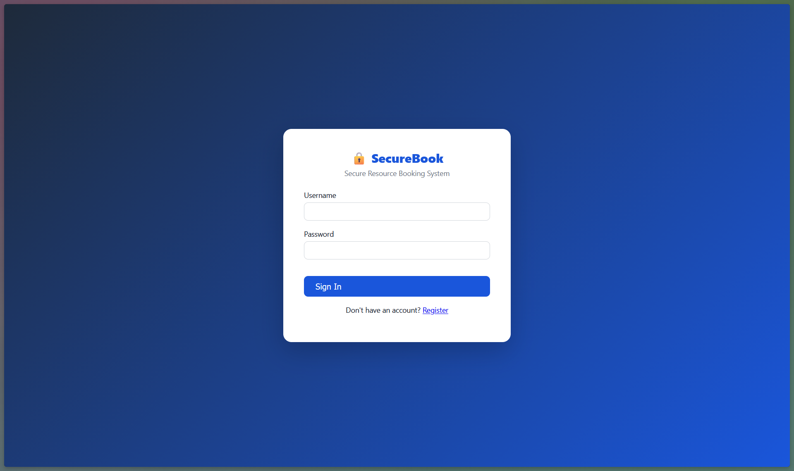
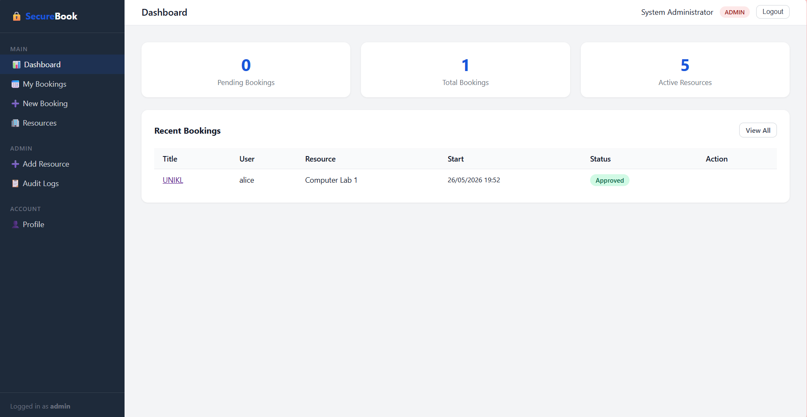
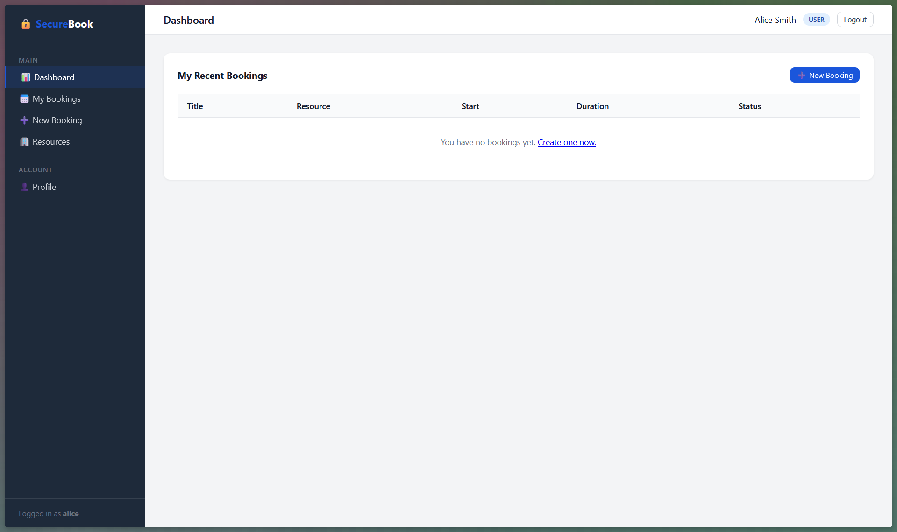
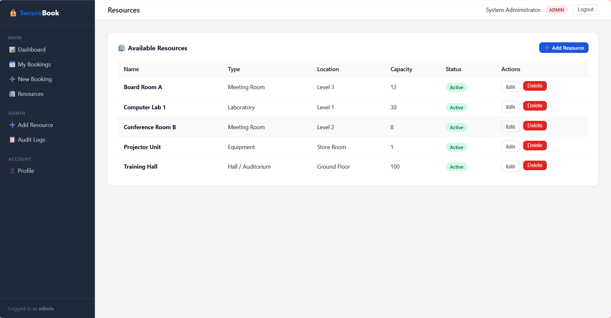
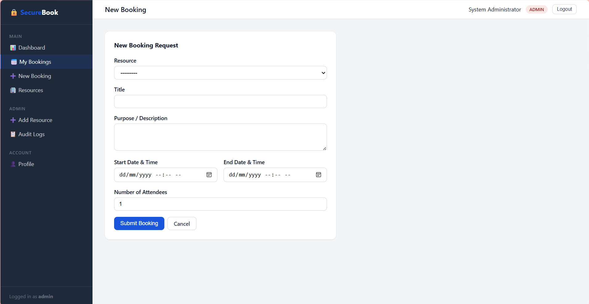
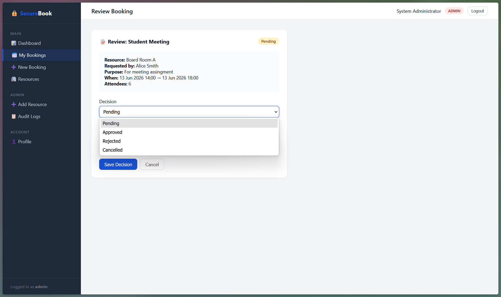
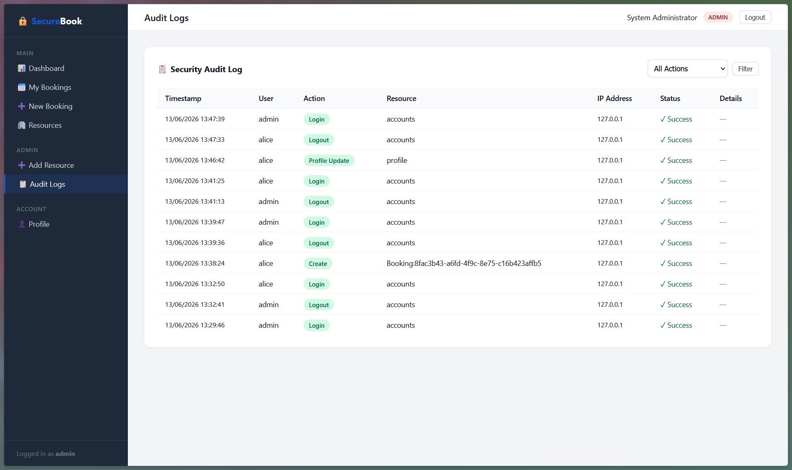
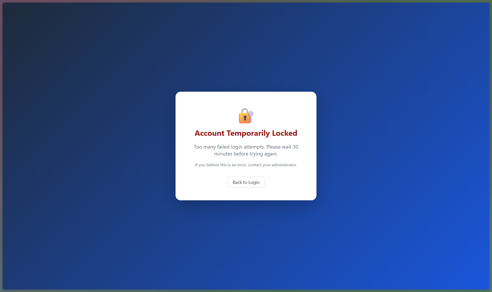
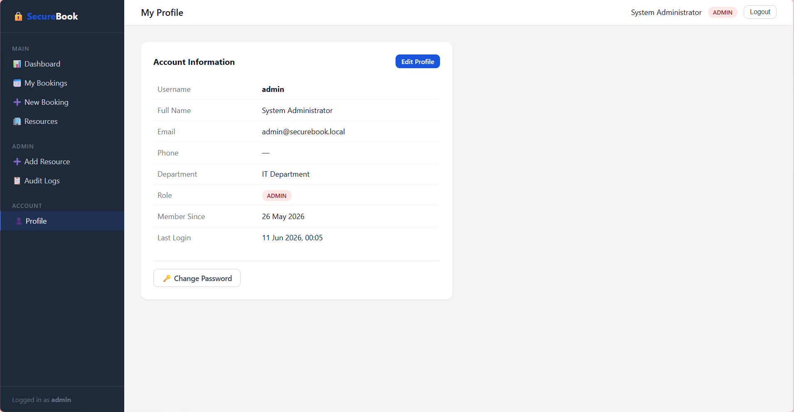
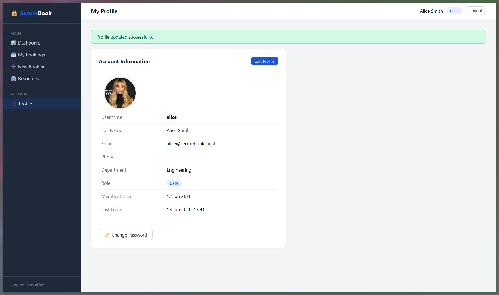

# SecureBook - Secure Resource Booking System


A secure web application for booking shared resources (rooms, labs, equipment), built with **Django 5.2.15** and designed to satisfy **OWASP Top 10** and **OWASP ASVS** requirements.

---

## Table of Contents

1. [Project Description](#1-project-description)
2. [Repository Structure](#2-repository-structure)
3. [Security Features](#3-security-features)
4. [Installation Steps](#4-installation-steps)
5. [How to Run the App](#5-how-to-run-the-app)
6. [Dependencies](#6-dependencies)
7. [Screenshots](#7-screenshots)

---

## 1. Project Description

**SecureBook** is a role-based resource booking platform where:

- **Admin users** manage resources (create, edit, delete rooms/labs/equipment) and approve or reject booking requests.
- **Normal users** register, log in, browse available resources, submit booking requests, and manage their own bookings.

Every layer of the application is built with security in mind - from the password hashing algorithm down to the HTTP response headers.

### Key Modules

| Module | Description |
|---|---|
| `accounts` | Registration, login, logout, profile, password change, audit log |
| `bookings` | Resource CRUD, booking CRUD, admin review workflow |
| `ssd_booking` | Django project config (settings, URLs, WSGI/ASGI) |

---

## 2. Repository Structure

```
SSD-WEB-APPLICATION/
│
├── accounts/                  # User auth, profiles, audit log
│   ├── migrations/
│   ├── admin.py
│   ├── apps.py
│   ├── forms.py               # Registration, login, profile, password-change forms
│   ├── models.py              # Custom User model + AuditLog model
│   ├── urls.py
│   ├── utils.py               # IP helper, log_audit(), axes_lockout_response()
│   └── views.py               # All accounts views (login, register, profile, audit)
│
├── bookings/                  # Resource & booking management
│   ├── migrations/
│   ├── admin.py
│   ├── apps.py
│   ├── decorators.py          # @admin_required decorator
│   ├── forms.py               # ResourceForm, BookingForm, BookingStatusForm
│   ├── models.py              # Resource + Booking models (UUID PKs)
│   ├── urls.py
│   └── views.py               # All booking views with IDOR protection
│
├── ssd_booking/               # Django project package
│   ├── settings.py            # Security-hardened settings
│   ├── urls.py                # Root URL config + custom error handlers
│   ├── wsgi.py
│   └── asgi.py
│
├── static/
│   └── css/
│       └── style.css          # Custom UI styles (sidebar, tables, forms)
│
├── templates/
│   ├── base.html              # Base layout with CSP meta tags + sidebar
│   ├── 400.html               # Bad request error page
│   ├── 403.html               # Forbidden error page
│   ├── 404.html               # Not found error page
│   ├── 500.html               # Server error page
│   ├── accounts/              # login, register, lockout, profile, audit_log
│   └── bookings/              # dashboard, resource_list/form, booking_list/form/detail/review
│
├── logs/                      # Runtime security logs (log files git-ignored, folder tracked)
│   └── security.log
│
├── uploads/                   # User file uploads (contents git-ignored, folder tracked)
│   └── profile_pictures/      # Profile images — renamed to UUID on upload
│
├── .env.example               # Template for required environment variables
├── .gitignore
├── manage.py
├── requirements.txt
├── seed.py                    # Demo data script (admin + alice + 5 resources)
└── README.md
```

---

## 3. Security Features

### 3.1 Authentication (OWASP ASVS V2)

| Control | Implementation |
|---|---|
| Password hashing | Argon2id via `argon2-cffi` (memory-hard, OWASP recommended) |
| Password strength | Min 8 chars, uppercase, lowercase, digit, special character |
| Brute-force protection | `django-axes` - 5 failed attempts triggers 30-minute lockout |
| Lockout logging | Every lockout event written to AuditLog with IP + user-agent |

### 3.2 Session Management (OWASP ASVS V3)

| Control | Implementation |
|---|---|
| Session timeout | 30 minutes (`SESSION_COOKIE_AGE = 1800`) |
| Session renewal | `SESSION_SAVE_EVERY_REQUEST = True` - resets on every request |
| Cookie flags | `HttpOnly=True`, `SameSite=Lax` |
| Cache control | `@never_cache` on all authenticated views |
| CSRF protection | Django CSRF middleware; logout is POST-only with `` |

### 3.3 Access Control (OWASP ASVS V4)

| Control | Implementation |
|---|---|
| Role-based access | `User.role` field (`admin` / `user`); `is_admin_user()` method |
| Admin decorator | `@admin_required` in `bookings/decorators.py` - renders 403 + logs |
| IDOR prevention | Non-admin booking queries always filtered by `user=request.user` |
| UUID primary keys | All `Resource` and `Booking` records use UUID PKs (no sequential IDs) |

### 3.4 Input Validation (OWASP ASVS V5)

- All form fields validated with **regex whitelist** patterns before saving
- `DateTimeField` inputs validated: start must be in the future, end > start, max 24 h duration
- Capacity: integer 1 - 10 000; attendees cannot exceed resource capacity
- `next` redirect parameter validated - must begin with `/` to prevent open redirect

### 3.5 Logging & Audit (OWASP ASVS V7)

The `AuditLog` model records:

| Event | Trigger |
|---|---|
| `LOGIN` | Successful login |
| `LOGIN_FAILED` | Failed login attempt |
| `LOGOUT` | User logout |
| `REGISTER` | New user registration |
| `PROFILE_UPDATE` | User updates profile info or picture |
| `PASSWORD_CHANGE` | User changes password |
| `CREATE` | Booking or resource created |
| `UPDATE` | Booking updated, cancelled, approved, or rejected |
| `DELETE` | Resource deleted by admin |
| `ACCESS_DENIED` | Forbidden access attempt (logged with IP) |

Logs store: timestamp, user, attempted username, IP address, user-agent, resource, outcome.  
Structured log file at `logs/security.log` (Django `LOGGING` config).

### 3.6 File Upload Security (OWASP ASVS V12)

| Control | Implementation |
|---|---|
| Extension whitelist | Only `.jpg`, `.jpeg`, `.png`, `.gif` accepted |
| MIME / magic-byte check | Pillow `Image.verify()` confirms actual image content, not just extension |
| Size limit | Max 2 MB enforced at form level; 5 MB hard cap in `settings.py` |
| Storage outside web root | Saved to `uploads/profile_pictures/` — separate from `static/` web-served directory |
| UUID rename | `profile_picture_path()` renames every file to `<uuid4_hex>.<ext>` on upload |

### 3.7 Injection Prevention

- **Zero raw SQL** - Django ORM used exclusively throughout
- All user inputs pass regex whitelist validators before the ORM layer

### 3.8 Security Headers

Set via Django middleware and `base.html` meta tags:

```
Content-Security-Policy: default-src 'self'; script-src 'self'; style-src 'self' 'unsafe-inline'; img-src 'self' data:; font-src 'self'
X-Content-Type-Options: nosniff
X-Frame-Options: DENY
```

### 3.9 Error Handling

Custom error pages for `400`, `403`, `404`, `500` - **no stack traces** or debug info exposed to users.

### 3.10 Secrets Management

All secrets (`SECRET_KEY`, `DEBUG`, `ALLOWED_HOSTS`, database URL) stored in `.env` via `python-decouple`. The `.env` file is git-ignored; `.env.example` documents all required keys.

---

## 4. Installation Steps

### Prerequisites

- Python 3.10+ (tested on 3.14.5)
- `pip`
- Git

### Step 1 - Clone the repository

```bash
git clone https://github.com/Dannyz15/SSD-WEB-APPLICATION.git
cd SSD-WEB-APPLICATION
```

### Step 2 - Create and activate a virtual environment

```bash
# Windows
python -m venv venv
venv\Scripts\activate

# macOS / Linux
python -m venv venv
source venv/bin/activate
```

### Step 3 - Install dependencies

```bash
pip install -r requirements.txt
```

### Step 4 - Configure environment variables

Copy the example file to create your local `.env`:

```bash
# macOS / Linux
cp .env.example .env

# Windows (Command Prompt or PowerShell)
copy .env.example .env
```

The `.env.example` already contains development-ready defaults. The **only value you must change** is `SECRET_KEY`:

```
SECRET_KEY=your-very-long-random-secret-key-here
```

Generate a strong key at **https://djecrety.ir/** and paste it into `.env`.

> For production deployment, uncomment and update the production values at the bottom of `.env` (see the comments inside the file).

### Step 5 - Apply database migrations

```bash
python manage.py migrate
```

### Step 6 - Create a superuser (admin account)

```bash
python manage.py createsuperuser
```

Follow the prompts to set a username, email, and password. This account can log in to the app and access the Audit Log and Django admin panel at `/admin/`.

### Step 7 - (Optional) Seed demo data

```bash
python seed.py
```

This creates:

| Role  | Username | Password    |
|-------|----------|-------------|
| Admin | `admin`  | `Admin@1234!` |
| User  | `alice`  | `Alice@1234!` |

And five sample resources: Board Room A, Conference Room B, Computer Lab 1, Training Hall, Projector Unit.

> If you run `seed.py`, you can skip Step 6 — it already creates an admin account.

---

## 5. How to Run the App

```bash
python manage.py runserver
```

Open your browser at: **http://127.0.0.1:8000**

| Path | Description |
|---|---|
| `/` | Redirects to login or dashboard |
| `/accounts/login/` | Login page |
| `/accounts/register/` | Registration page |
| `/accounts/profile/` | User profile |
| `/bookings/dashboard/` | Main dashboard (role-aware) |
| `/bookings/resources/` | Resource list (admin: full CRUD) |
| `/bookings/` | Booking list |
| `/accounts/audit-log/` | Audit log (admin only) |
| `/admin/` | Django admin panel |

### Running in Production

Set the following in `.env` before deploying:

```
DEBUG=False
ALLOWED_HOSTS=yourdomain.com
SESSION_COOKIE_SECURE=True
CSRF_COOKIE_SECURE=True
SECURE_HSTS_SECONDS=31536000
SECURE_SSL_REDIRECT=True
```

---

## 6. Dependencies

| Package | Version | Purpose |
|---|---|---|
| Django | 5.2.15 | Web framework |
| argon2-cffi | 23.1.0 | Argon2id password hashing |
| argon2-cffi-bindings | 25.1.0 | C bindings for argon2-cffi |
| django-axes | 7.0.0 | Brute-force login protection |
| Pillow | 12.2.0 | Image processing for file upload validation |
| python-decouple | 3.8 | `.env` secrets management |
| whitenoise | 6.8.2 | Static file serving |
| sqlparse | 0.5.5 | Django SQL formatting (dev) |
| asgiref | 3.11.1 | Django ASGI support |
| cffi | 2.0.0 | C foreign function interface |
| pycparser | 3.0 | C source parser (cffi dep) |
| tzdata | 2026.2 | Timezone data |

Install all with:

```bash
pip install -r requirements.txt
```

---

## 7. Screenshots

> Screenshots below show the live application after running `python seed.py` and `python manage.py runserver`.

### Login Page


### Admin Dashboard


### User Dashboard


### Resource List (Admin)


### Create Booking


### Booking Review (Admin)


### Audit Log (Admin Only)


### Lockout Page


### My Profile


### Profile Picture Upload


---

## GitHub Repository

- **Repository:** https://github.com/Dannyz15/SSD-WEB-APPLICATION
- **Version:** v1.0.0
